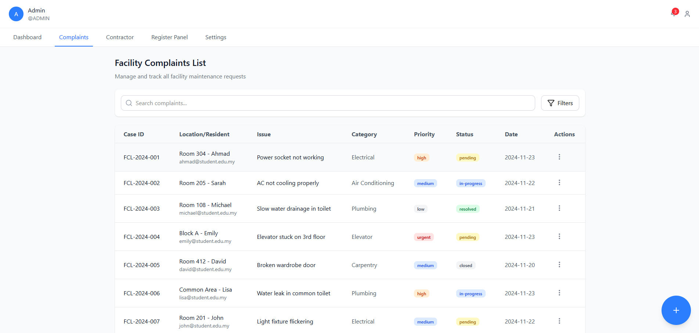
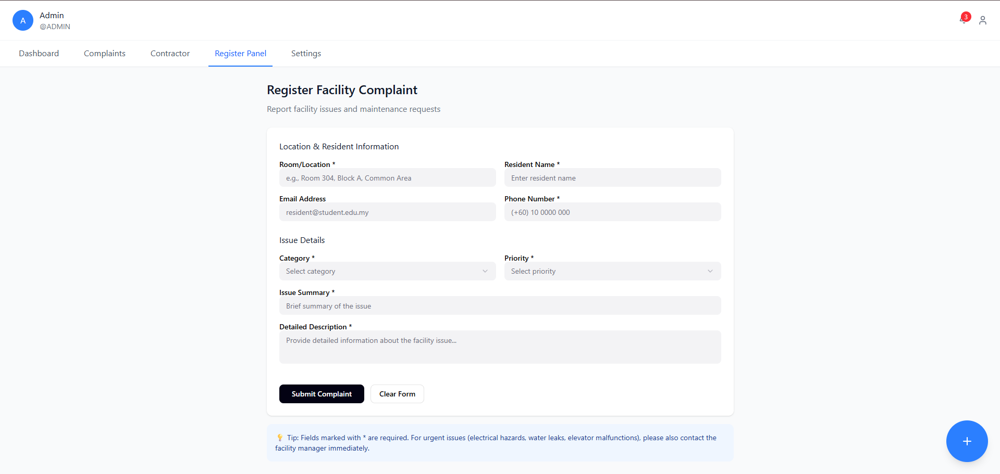
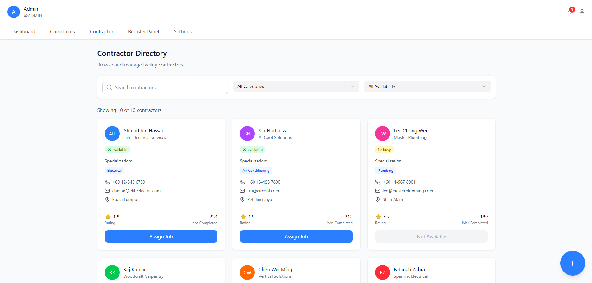
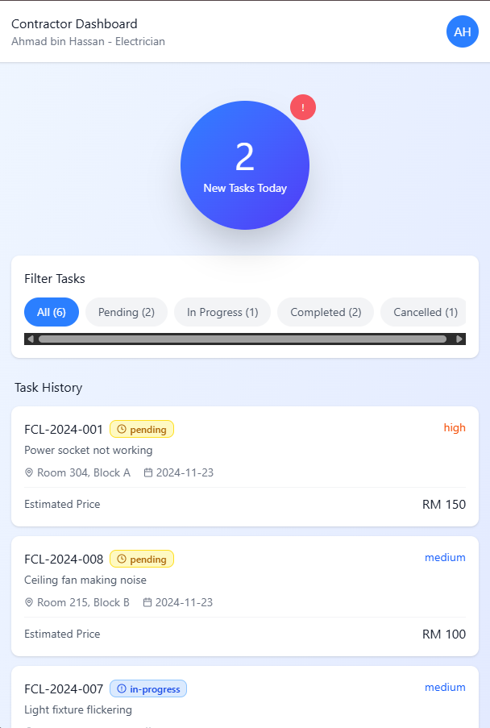
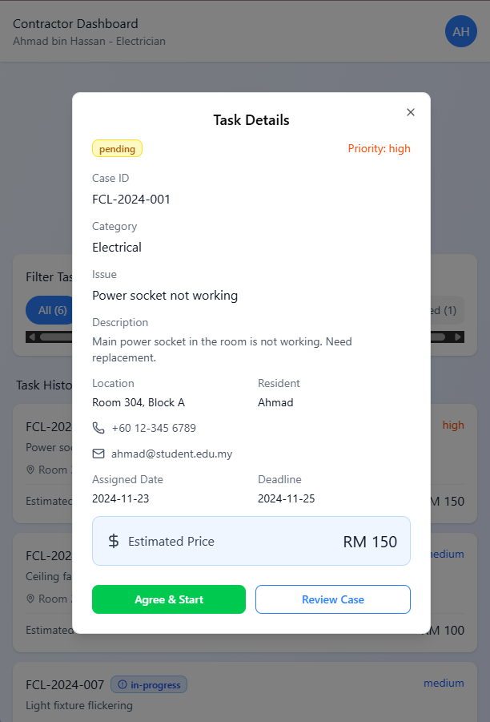

  # Complaints Handling Management Page

  This is a prototype for a Complaints Handling Management Page. The original project is available at https://www.figma.com/design/yONvYGh4s2Jp7sFwhv55u6/Complaints-Handling-Management-Page.

  ## Screenshots

  ### Dashboard
  
  
  The main dashboard interface for managing and tracking customer complaints with comprehensive overview and analytics.

  ### Complaints List
  
  
  View and manage all customer complaints in a detailed list format.

  ### Add Complaints
  
  
  Form interface for submitting new complaints with all necessary details.

  ### Contractors List
  
  
  Manage and view the list of contractors assigned to handle complaints.

  ### Mobile Dashboard
  
  
  Mobile-responsive dashboard view for on-the-go complaint management.

  ### Mobile Dashboard Details
  
  
  Showing complaint information and status updates.

  ## Running the code

  Run `npm i` to install the dependencies.

  Run `npm run dev` to start the development server.
  